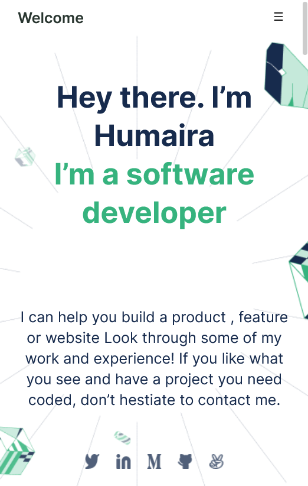

# My Portfolio

> **[This](https://qwibbler.github.io/my-portfolio/)** is a practice portfolio that I am building to learn the required coding skills for building a basic website for both desktop and mobile screens, and to begin setting up my very own portfolio. I will be expanding on this in the various tutorial excersizes as I progress along Microverse.

> 
> 

## Built With

- HTML and CSS
- Javascript

## Live Demo

[Live Demo Link](https://qwibbler.github.io/my-portfolio/)

## Author

👤 **Humaira Zaman**

- GitHub: [@qwibbler](https://github.com/qwibbler)
- Twitter: [@hmemaz](https://twitter.com/hmemaz)
- LinkedIn: [Humaira Zaman]( www.linkedin.com/in/humaira-zaman)

### With help from

👤 **Fabiano Frank**

- GitHub: [@fabianofrank](https://github.com/fabianofrank)

👤 **Azeez Rotimi Arigbabuwo**

- GitHub: [@ayebaishmo](https://github.com/ayebaishmo)

## 🤝 Contributing

Contributions, issues, and feature requests are welcome!

Feel free to check the [issues page](../../issues/).

## Show your support

Give a ⭐️ if you like this project!

## Acknowledgments

- [Template 3](https://www.figma.com/file/l7SqJ3ZfkAKih9sFxvWSR4/Microverse-Student-Project-1?node-id=34%3A2068)

## 📝 License

This project is [MIT](./MIT.md) licensed.
